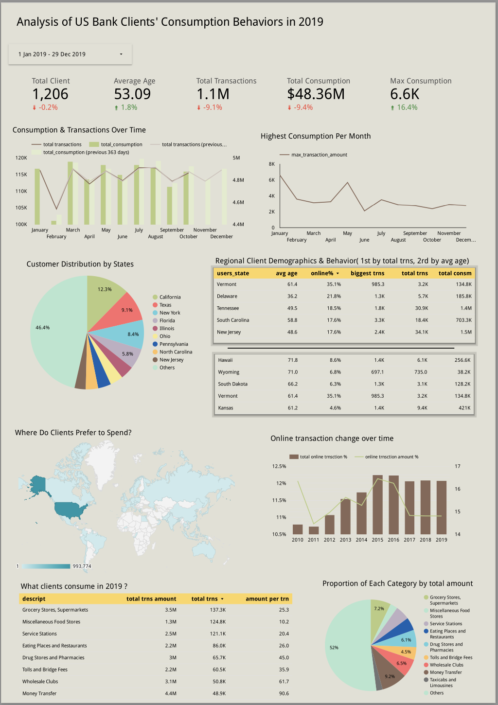

# Introduction
This project demonstrates a proof of concept for an end-to-end data ingestion pipeline, leveraging Terraform, Google Cloud Platform (GCP), Apache Airflow, and Docker. It processes financial transaction data from a banking institution, generating a comprehensive dashboard that analyzes customer behavior by comparing 2019 with 2018. It also includes trends in customers' online consumption over time.  
For accuracy, only successful transactions were considered in the analysis, as the dataset also contains fraudulent transactions.

# Data source
This dataset is sourced from [Kaggle](https://www.kaggle.com/datasets/computingvictor/transactions-fraud-datasets/data), containing transaction data, user information, and card details from 2010 to 2019. To enhance its usability, I imported the dataset into [my GitHub repository](https://github.com/LilyTao123/financial-transaction-data/tags) and re-mapped the state and country columns for better clarity and consistency.  
For example, the original dataset includes 'latitude' and 'longitude' coordinates. I have used this data to determine users' locations at the state and city levels, and created a new column.

# Technology

# ETL Pipeline Design
All processed data is stored in a Google Cloud Storage (GCS) bucket and loaded into BigQuery.  

Terraform will create three resources: a GCS bucket named 'financial_transaction_bucket', a dataset named 'financial_transaction', and another dataset named 'financial_transaction_transformed_data'.  

Airflow is used for the initial ingestion and transformation of data. All stored in the BigQuery dataset 'financial_transaction'. The transaction table is partitioned by transaction_date. The ingested data includes:  
* transactions: financial transaction records.  
* users: clients information, including age, location, yearly income and etc.  
* cards: clients cards info, including type of cards, expired date and etc.  
* mcc： transaction categorization, column 'description' would tell the category of each transaction.  

DBT combines multiple datasets to create the tables, which are stored in BigQuery dataset 'financial_transaction_transformed_data', They will be used for dashboard building.：  
* clients_consumption_2019 : to describe clients behaviour in 2019  
* online_trsn_over_time : online transaction amounts and the total number of transactions from 2010 to 2019, enabling an analysis of changes over time.

# Pre-requisites
1. Git
   install git (https://git-scm.com/book/en/v2/Getting-Started-Installing-Git)
2. GCP
   create google cloud account
3. Terraform
   install terraform (https://developer.hashicorp.com/terraform/install?product_intent=terraform)
4. Docker and docker-compose
   install docker and docker-compose (https://docs.docker.com/desktop/setup/install/mac-install/)

# To run this project
## a. Clone git repository
``` git clone https://github.com/LilyTao123/financial_transaction_etl_airflow_dbt.git ```
## b. Create GCP service account and credential keys
### b.1 create service account
create a service account: IAM and admin -> service accounts -> click 'service account', and include the below permissions
```
  - BigQuery Admin
  - Compute Admin
  - Service Account Admin
  - Service Account User
  - Storage Admin
``` 
### b.2 create credential keys
create credential key under the service account, click 'JSON', and download it, rename as 'google_creds.json'

### b.3 rename and save it
Save and rename the keys under the directory ```airflow-etl```, with the path being ```/airflow-etl/.keys/google_cloud/google_creds.json```.

## c. Update .env
```  
GCP_PROJECT_ID=<your project id>
GCP_GCS_BUCKET=financial_transaction_bucket
GCP_BIGQUERY_DATASET=financial_transaction
AIRFLOW_UID=1001
```

## d. Copy .env file into airflow-etl
Remember you need to copy .env into folder airflow-etl

## e. Set up Terraform
To create the required resources, use Terraform by running the following commands in your terminal:

1. initialise terraform
   ``` terraform init ```
2. preview the plan
   ``` terraform plan ```
3. create resources
   ``` terraform apply```

## f. Build airflow image
``` 
cd airflow-etl
docker-compose build
docker-compose up
```
or 
```
cd airflow-etl
docker-compose up --build
```


## g. Access to airflow
open ```http://localhost:8080 ``` in your browser, username and password both are 'airflow'

### g.1 Add spark connection
In the top navigation bar, go to Admin > Connections > + > Fill in the following: Connection Id: 'spark-conn' Connection Type: 'spark' Host: 'spark://spark-master' Port: '7077'

### g.2 Run the DAGs in the following order
You will see this in airflow UI 


And you need to run them in the following order: dimension_ingestion_gcs_dag >> trnsaction_ingestion_gcs_dag >> dbt_run_job  
To run then, click the triangle in the right-top corner


After they run successfully, you will observe the following:
1. New GCS bucket named <your-project-id>-financial_transaction_bucket:  
gs://your-bucket-name/    
│── dimension/    
│   ├── user/user.parquet   
│   ├── cards/cards.parquet  
│   ├── mcc/mcc.parquet    
│── trnsction/  
|   |── trnsction.parquet  


3. New tables in your GCS BigQuery dataset financial_transaction:
  user, cards, trnsction, mcc  
4. New tables in your GCS BigQuery dataset financial_transaction_transformed_data:
  * clients_consumption_2019
  * online_trsn_over_time(which is a view)  
## h. Destroy resources
Use terraform to destroy resources  
``` terraform destroy ```

# Data Visualisation
The link of dashboard is [here](https://lookerstudio.google.com/reporting/5f3042d3-6fa7-48b8-9a3f-a99e3b35a3d7/page/4fgEF/edit), but you may need to reconnect the data if you want to edit it.

